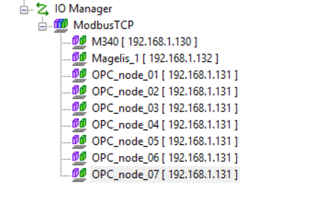
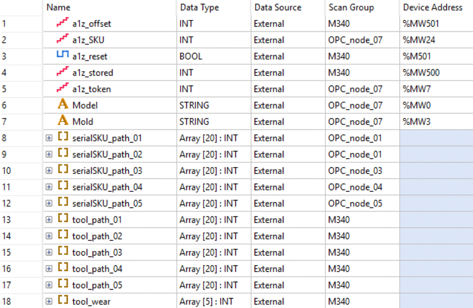
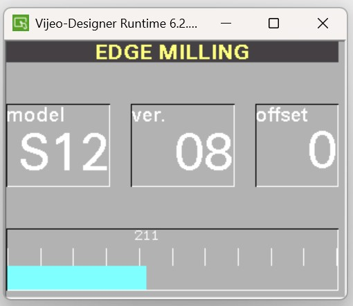
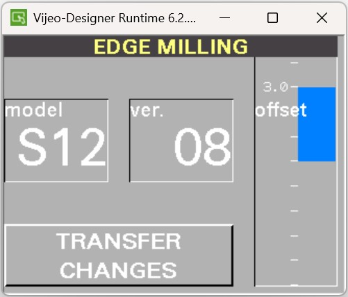

## HMI Interface and Operator Workflow

In this system HMI (Magelis_1) acts as the communication gateway between the SQL/OPC layer and the PLC (M340).



This approach was chosen because the PLC cannot interface directly with OPC or SQL servers. The data transfer sequence is as follows:

```
┌─────────────┐   OPC DA/UA      ┌────────────┐   Modbus TCP/CANopen    ┌──────────────┐ 
│  SQL Server │ <------------->  │  OPC Server│ <---------------------> │     HMI      │
└─────────────┘                  └────────────┘                         │  (Magelis)   │
                                                                        └───────────┬──┘
                                                                                    │
                                                                                    ▼
                                                                   ┌───────────────────┐
                                                                   │ PLC (Modicon M340)│
                                                                   └───────────────────┘

```

- SQL Server stores a set of processing variables for the CNC machine.

- OPC Server acts as a middleware layer, exposing SQL data as OPC tags.

- HMI (Magelis) operates as the OPC client, reading parameters from OPC and serving as the only master for PLC communication.

- PLC (Modicon M340) receives parameter values exclusively from HMI, with no direct OPC or SQL connectivity.

This design ensures all data validation, control, and variable injection occur at the HMI level, providing a secure and transparent integration between enterprise data and field automation.




#### Bidirectional SQL Communication and Parameter Injection

After the operator scans the product’s serial number, a stored procedure on the SQL server uses the serial number’s linked model, submodel, and recipe values to populate a table with model-specific CNC toolpath targets and all processing parameters — such as feed rate and spindle speed.

The OPC Server periodically executes queries to the SQL Server, retrieves relevant data, and updates the values of its assigned OPC nodes accordingly.

The HMI Magelis panel actively scans the OPC nodes, retrieving the latest values. For a subset of variables, it functions as a gateway, writing these values into the memory cells of the Modicon PLC. Other variables are displayed on the HMI for operator information or manual adjustment.

#### HMI Interface and Operator Workflow

The HMI interface shown in the image represents the initial screen displayed after the operator scans the serial number of the product.




The numeric bar at the bottom of the screen (e.g., 211) displays the current estimated tool usage, expressed in normalized units. Each model/recipe has a predefined weighting factor that reflects how aggressively it wears the tool. This allows heterogeneous models to be normalized into a standardized cycle count. After each completed operation, the system increments this counter based on the model's weighting coefficient. This approach supports predictive tool replacement without requiring per-model calibration.

#### Manual Offset Correction

When launching a new mold, the default Z-position retrieved from SQL may be slightly off. In this case, the operators can enter manual correction mode. Using a rotary dial, operator can fine-tune the spindle’s Z-position up or down relative to the model default. The right-hand bar graph visually displays the offset in real time.




If the correction proves to be consistently required for a specific mold instance, the operator presses the “Transfer Changes” button. The system writes the updated Z-offset value back to the SQL Server, updating the record for **this mold instance**.

As a result, the next product using the same mold instance will automatically use the corrected value. The operator can further refine the value and repeat the process as needed.

> ✅ The long-term goal is to eliminate the need for operator input altogether.  
> Once mold-specific offsets are tuned and saved, the process can run hands-free, with all execution triggered via physical buttons START/STOP — ideal for gloved operators.  
> The HMI is used only during the initial learning phase, after which it becomes purely optional.


#### OPC Node Lua Handler

An example Lua script is provided for one of the OPC nodes. It demonstrates:

- SQL read and write operations,
- Injection of SKU and mold-based parameters into Modbus OPC tags,
- Optional write-back to the SQL table if a Z-offset correction is applied by the operator.

```lua
---- initialize
function OnInit()
    host = "ProductionSQL"                -- name of the ODBC connector
    login = "masterOPC"                   -- login username
    password = "******"                   -- login password

    env = odbc.env_create()              -- create ODBC environment object
    CONN, s = odbc.env_connect(env, host, login, password)  -- attempt connection

    if (CONN == nil) then
        server.Message(s)                -- print error message if connection fails
    end
end

---- deinitialize
function OnClose()
    odbc.conn_close(CONN)                -- close connection
    odbc.env_close(env)                  -- close environment
    odbc.cur_close(res)                  -- close cursor (if open)
end

---- handling
function OnBeforeReading()

    -- Step 1: fetch the latest serial number from a buffer table
    cur0, s = odbc.conn_execute(CONN, [[
        SELECT serialNum
        FROM dbo.tokenCNC
    ]])
    if cur0 == nil then
        server.Message("Error - ", s)
        odbc.conn_close(CONN)
        return
    end
    row0 = odbc.cur_fetch(cur0)
    serialNum = row0.serialNum

    -- Step 2: retrieve SKU and moldNum for this serial number
    local SQL_1 = [[
        SELECT SKU, moldNum
        FROM serialSKU
        WHERE serialNum =
    ]]
    SQL_1 = SQL_1 .. string.format("('%s')", serialNum)
    cur1, s = odbc.conn_execute(CONN, SQL_1)
    if cur1 == nil then
        server.Message("Error - ", s)
        odbc.conn_close(CONN)
        return
    end
    row1 = odbc.cur_fetch(cur1)
    SKU = row1.SKU
    moldNum = row1.moldNum

    -- Step 3: retrieve Z-axis correction (a1z) based on moldNum
    local SQL_2 = [[
        SELECT a1z
        FROM moldNum
        WHERE moldNum =
    ]]
    SQL_2 = SQL_2 .. string.format("('%s')", moldNum)
    cur2, s = odbc.conn_execute(CONN, SQL_2)
    if cur2 == nil then
        server.Message("Error - ", s)
        odbc.conn_close(CONN)
        return
    end
    row2 = odbc.cur_fetch(cur2)
    a1z = row2.a1z
end

---- handling
function OnAfterReading()

    -- Write values to Modbus OPC tags
    server.WriteTag("Modbus TCP .ID_2.Model", string.sub(SKU, 1, 2))
    server.WriteTagToDevice("Modbus TCP .ID_2.Model", string.sub(SKU, 1, 2))

    server.WriteTag("Modbus TCP .ID_2.Mold", moldNum)
    server.WriteTagToDevice("Modbus TCP .ID_2.Mold", moldNum)

    server.WriteTag("Modbus TCP .ID_2.a1z_SQL", a1z)
    server.WriteTagToDevice("Modbus TCP .ID_2.a1z_SQL", a1z)

    -- Check if spindle correction was entered manually on HMI
    res, s = server.ReadTag("Modbus TCP .ID_2.a1z_token")
    if res ~= 0000 then
        -- Write manual correction value back to SQL
        local SQL_3 = [[
            UPDATE moldNum
            SET a1z =
        ]]
        SQL_3 = SQL_3 .. string.format("('%s') WHERE moldNum = ('%s')", res, moldNum)
        res1, s = odbc.conn_execute(CONN, SQL_3)
        if res1 == nil then
            server.Message("Error - ", s)
            odbc.conn_close(CONN)
            return
        end
        -- Reset the manual correction tag
        server.WriteTag("Modbus TCP .ID_2.a1z_token", 0000)
        server.WriteTagToDevice("Modbus TCP .ID_2.a1z_token", 0000)
    end

    -- Close all cursors
    odbc.cur_close(cur0)
    odbc.cur_close(cur1)
    odbc.cur_close(cur2)
end
```

