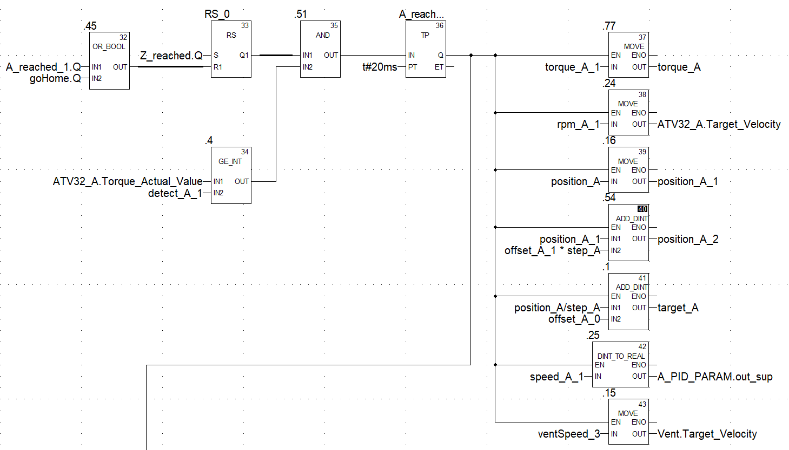
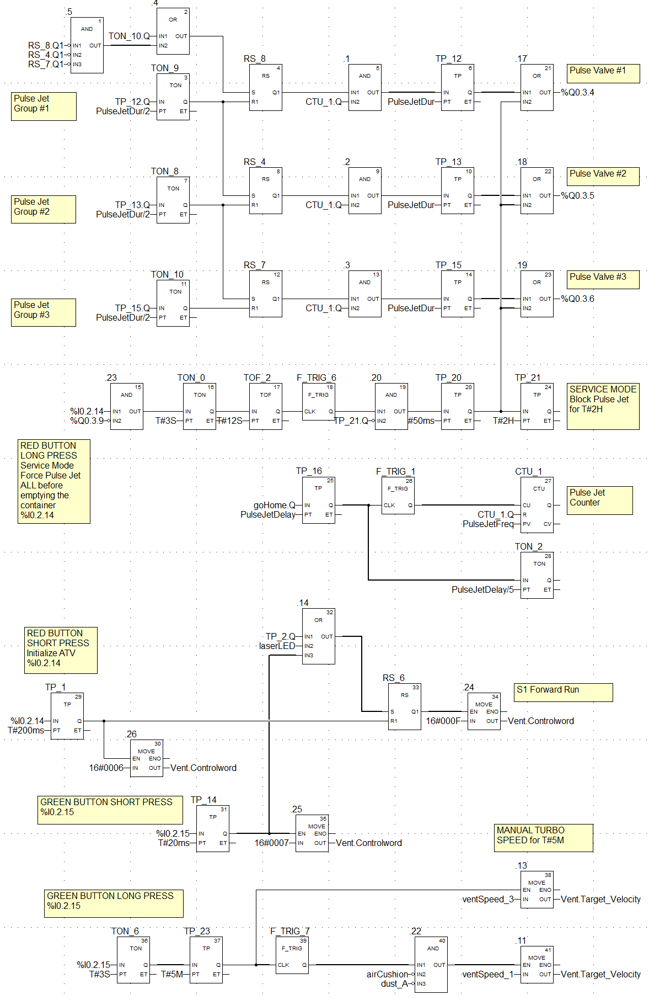

## Modicon PLC FBD Snippets

This section presents several logic blocks for the Schneider Modicon M340, written in FBD (Function Block Diagram) and used in real-world production.

#### Determining processing coordinates for a product with unstable geometry

In some cases, certain machining operations must be performed not in absolute coordinates relative to the machine bed, but **in relative depth** from the external surface of the workpiece. To achieve this, the system utilizes a fully automated method relying solely on the capabilities of the **Modicon M340 PLC**, without additional probing sensors.

At the start of the machining cycle, the system uses the product's serial number to dynamically retrieve all relevant parameters from the **SQL database**, including:
- The estimated surface position along the Z-axis,
- Safety buffer distance,
- Initial spindle speed and feed-rate settings.

These parameters are transmitted to the **Modicon M340 PLC** via **HMI/OPC** and mapped into dedicated memory areas within the controller.  
1. Using the received values, the Z-axis spindle performs a two-phase descent:
   - It rapidly moves to the pre-contact level (estimated surface minus safety zone),
   - Then enters slow approach mode, reducing vertical speed as it enters the safety buffer, while the spindle ramps up to the defined operating RPM in preparation for surface detection.

2. When the cutting tool contacts the workpiece, a sudden increase in spindle current is detected.

   This current spike is transmitted via CANopen from the drive to the Modicon M340, which uses it to:
   - Establish the actual surface level (Z-reference point) as the reference coordinate,
   - Begin subsequent machining operations from the reference coordinate.

**Trigger RS_0:**
 The axis reaches the safety threshold Z_reached.Q (value taken from the SQL table for the given serial number), entering the slow approach mode.

**Comparator GE_INT:**
Compares the current spindle drive current, received via CANopen, to a predefined threshold (+ 30%-35% from idle current).

**Logic AND 35 and Pulse Shaper TP 36:**
When the Z-axis is in collision-detection mode and the comparator output is TRUE, this triggers the writing of variables:

- `torque_A` — torque setpoint for the PID controller (see separate logic).
- `ATV32_A.TargetVelocity` — spindle rotation speed for this section of the trajectory.
- `position_A_1` — **zero coordinate value** for relative trajectory calculations.
- `position_A_2` and `target_A` — calculated values for trajectory segments.
- `A_PID_PARAM.out_sup` — feed rate setpoint for the PID controller.
- `Vent.Target_Velocity` — CANopen command to increase the dust collector fan speed by 20% above nominal (short-term mode).

This approach enables dynamic surface referencing  — ensuring high machining accuracy and long-term process reliability even when surface conditions vary.

The system also leverages spindle current data to **estimate cutting tool wear**:

As the tool wears down, the Z-servo drive current increases under identical cutting conditions. The system is configured to automatically compensate minor wear by increasing RPM and decreasing feed rate, within pre-approved safety limits. When wear thresholds are breached, the equipment switches to service mode and logs relevant data to the SQL database 

#### Maintaining Constant Spindle Load

In one section where materials of unknown density must be processed, it proved effective to regulate the feed-rate in order to maintain a constant current in the spindle windings. This was achieved using a PID controller integrated into the feed-rate control loop.

**ATV32_A.Torque_Actual_Value** — CANopen variable, converted from Numeric to Real.

**torque_A** — setpoint for the desired torque value, converted from Numeric to Real.

**A_PID** — PID controller for the feed rate, maintaining ATV32_A.Torque_Actual_Value around torque_A.

**0.74** — Output converter Real to Numeric for transmitting the value to the feed rate control loop.

#### Dust Collection and Filter Maintenance Optimization

During machining, a large amount of highly abrasive dust is generated. Even a bank of cyclone separators is insufficient, as fine dust still enters the air downstream of the cyclones. As a result, a baghouse filtration system was installed.

The main challenge was to maximize the service life of the filter bags, which required finding the optimal compromise between pulse jet frequency and filter longevity. Infrequent cleaning increases airflow resistance, while overly frequent cleaning significantly reduces the lifespan of the filters.

The solution was to implement a rotating cleaning sequence: during each cleaning cycle, only one third of the filter bags are cleaned at a time. This approach reduced compressed air consumption per jet pulse and, most importantly, greatly improved cleaning quality. 

Each machining operation increments the counter `CTU_1` by 1. Once the counter reaches the threshold `PulseJetFreq`, logical latches `AND_5`, `AND_9`, and `AND_13` are enabled to pass the state of triggers `RS_8`, `RS_4`, and `RS_7`.

At any given time, only **one of the three** RS triggers is active, enabling rotation of the control signal between the three pulse valves. This design ensures more efficient cleaning of bag filter groups while reducing compressed air consumption per pulse.

The remaining logic covers **service modes**:

- **RED BUTTON LONG PRESS** — triggers a forced **PULSE JET** for all filter groups to prepare for dust bin emptying. It also activates a lockout timer to **block further pulses for two hours**, ensuring enough time for container replacement.

- **GREEN BUTTON LONG PRESS** — activates a forced **TURBO mode** of the dust collector fan, used during scheduled maintenance and cleaning procedures.
